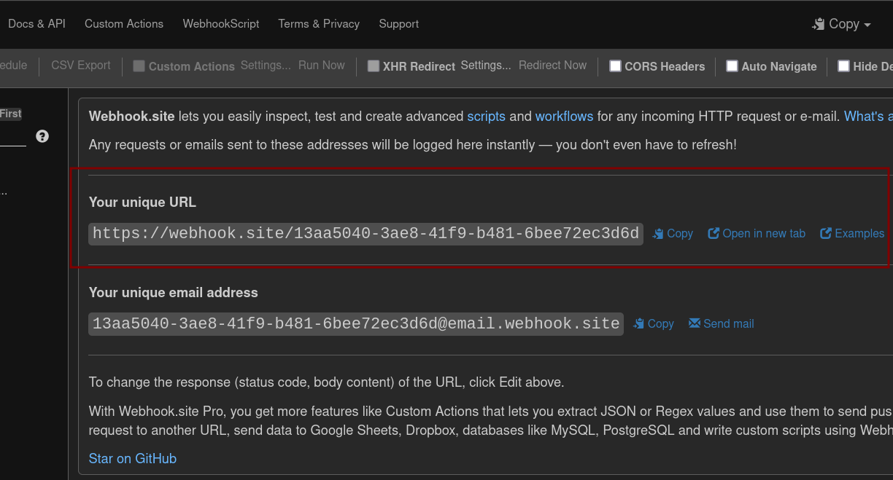
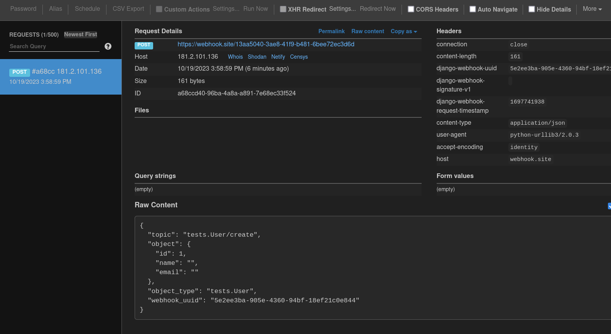

# Quickstart

## Requirements

Django Webhook depends on Celery for background processing. Celery is the de-facto background
processing system for Django.

Django-Webhook sends each webhook within the context of a Celery task. This allows us to offload
webhook logic from Django and automatically retry failed requests.

To install Celery in your Django project see: https://docs.celeryq.dev/en/stable/django/first-steps-with-django.html

**Make sure that your project has a Celery worker running. This component is in charge of sending
webhooks.**

## Installation

To demonstrate and example the below code assumes we have a model called `Product` in an application called `Core`.

You don't have to include the code sample, any of your own models could work.

```python
from django.db import models

class Product(models.Model):
    name = models.CharField(max_length=50)
```

Install the python package

```sh
pip install django-webhook
```

Add the app to your settings.py and whitelist models for which you want to send webhooks
```python
INSTALLED_APPS = [
    "django_webhook"
]

# Whitelist models for which we send webhooks
DJANGO_WEBHOOK = dict(MODELS=["core.Product", "users.User"])
```

Run the migrations

```sh
./manage.py migrate
```

## Test outgoing webhooks

Visit https://webhook.site to create an inbox for your webhooks. Copy the unique URL which will be
the destination for our webhook.



Configure an outgoing webhook for one of your models

```python
./manage.py shell

>>> from django_webhook.models import Webhook, WebhookTopic
>>> webhook = Webhook(url="https://webhook.site/13aa5040-3ae8-41f9-b481-6bee72ec3d6d")
>>> webhook.save()
```

Set the topic to be triggered on create and update for your model.
```python
>>> topics = [WebhookTopic.objects.get(name="core.Product/create"), WebhookTopic.objects.get(name="core.Product/update")]
>>> webhook.topics.set(topics)
```

Finally create a new Product instance to trigger the webhook.

```python
>>> from core.models import Product
>>> Product.objects.create(name="test")
```

Visit the page for your unique webhook where you can expect the incoming HTTP request.


